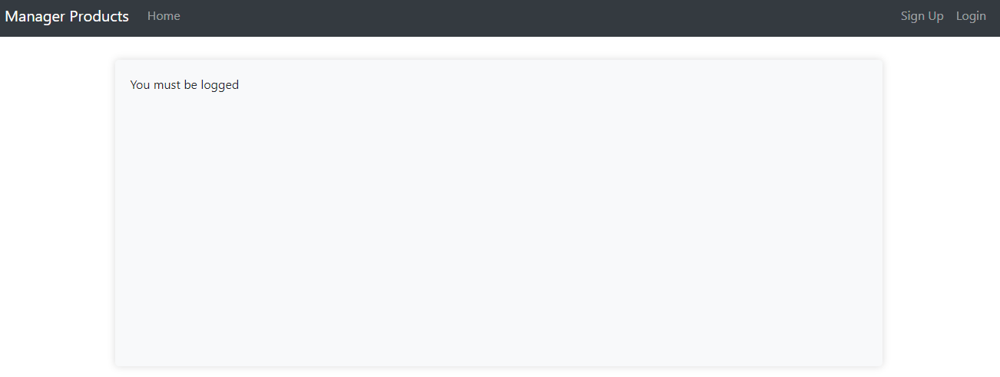
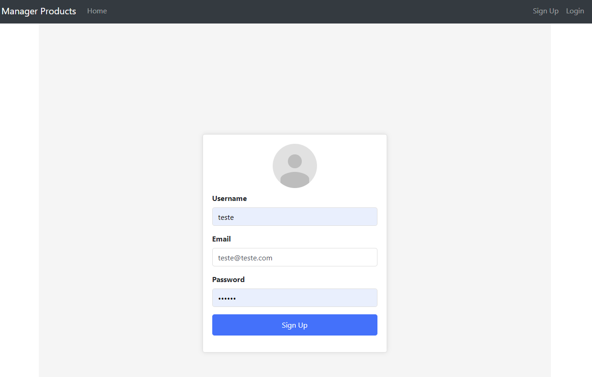
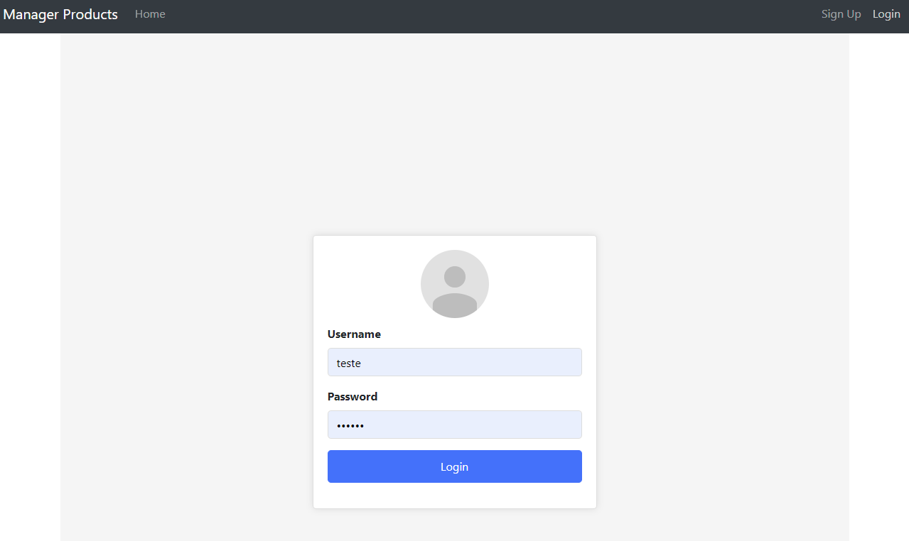
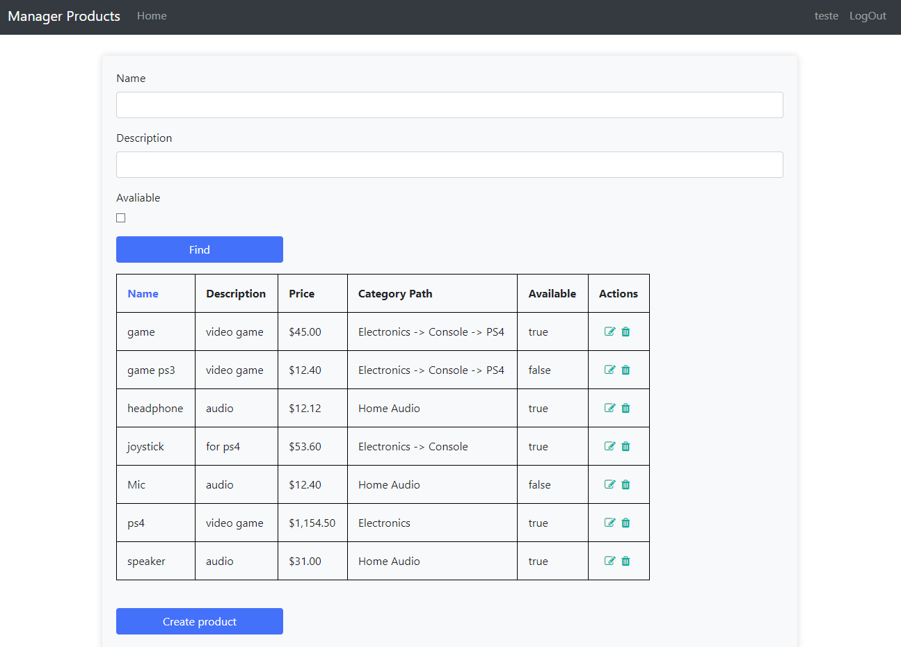
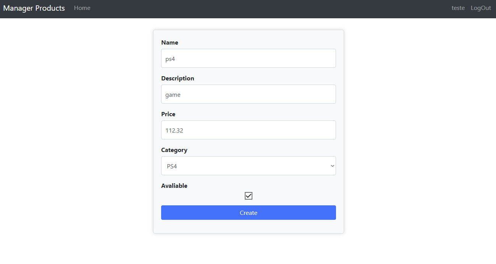

## Run Dependencies install
```
npm i
```

# Dependencies
Node: [14.15.4](https://nodejs.org/en/blog/release/v14.15.4)


Run `ng serve` for a dev server. Navigate to `http://localhost:4200/`.












